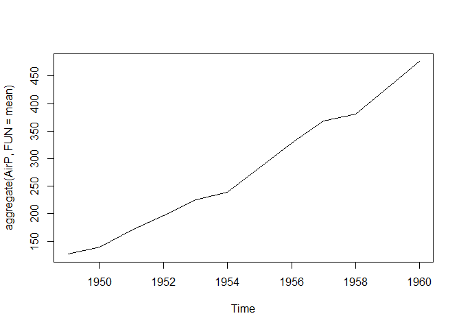
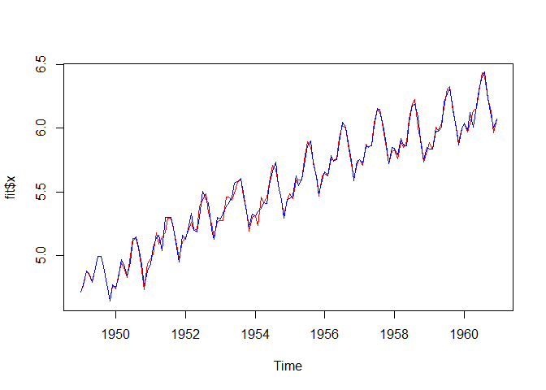
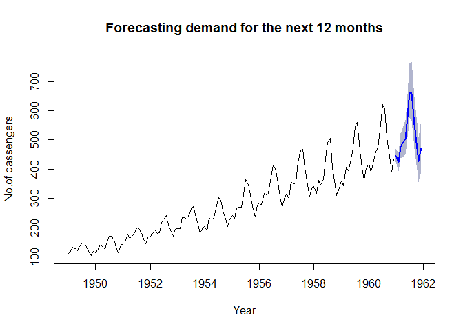
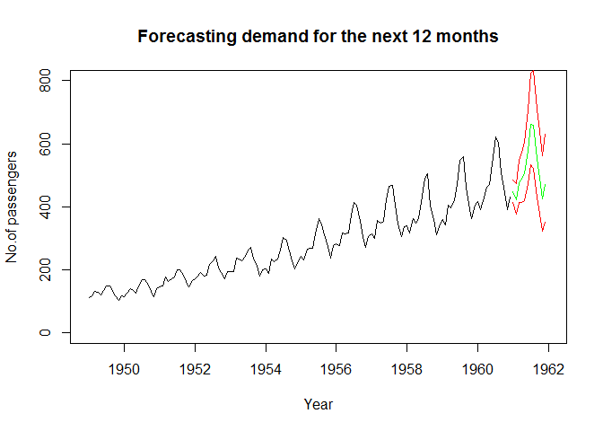

Load the required packages


```r
suppressPackageStartupMessages({
    library(forecast)
    library(tseries)
    library(MASS)
    library(lmtest)
})
```

Let's load the dataset into R studio environment


```r
data("AirPassengers")

AirP <- AirPassengers
class(AirP)
```

```
## [1] "ts"
```

```r
#Check the Start of the Time Series 
start(AirP)
```

```
## [1] 1949    1
```

```r
# Check the end of the time series 

end(AirP)
```

```
## [1] 1960   12
```

```r
#Check the Summary of the data 

summary(AirP)
```

```
##    Min. 1st Qu.  Median    Mean 3rd Qu.    Max. 
##   104.0   180.0   265.5   280.3   360.5   622.0
```


####Explore the data with plotting


```r
boxplot(AirP)
```

<!-- -->

```r
plot.ts(AirP)
abline(reg = lm(AirP ~time(AirP)),col="red") 
```

<!-- -->

Seems like the timeseries is multiplicative.


```r
plot(aggregate(AirP,FUN = mean))
```

<!-- -->

The above graph shows trend line and seasonal effect


```r
#Print the cycle of the year 
cycle(AirP)
```

```
##      Jan Feb Mar Apr May Jun Jul Aug Sep Oct Nov Dec
## 1949   1   2   3   4   5   6   7   8   9  10  11  12
## 1950   1   2   3   4   5   6   7   8   9  10  11  12
## 1951   1   2   3   4   5   6   7   8   9  10  11  12
## 1952   1   2   3   4   5   6   7   8   9  10  11  12
## 1953   1   2   3   4   5   6   7   8   9  10  11  12
## 1954   1   2   3   4   5   6   7   8   9  10  11  12
## 1955   1   2   3   4   5   6   7   8   9  10  11  12
## 1956   1   2   3   4   5   6   7   8   9  10  11  12
## 1957   1   2   3   4   5   6   7   8   9  10  11  12
## 1958   1   2   3   4   5   6   7   8   9  10  11  12
## 1959   1   2   3   4   5   6   7   8   9  10  11  12
## 1960   1   2   3   4   5   6   7   8   9  10  11  12
```

```r
boxplot(AirPassengers~cycle(AirPassengers))
```

<!-- -->

**Seasonality effect during July & August**


The time series has the following 3 components 

1. Trend 
2. Seasonality 
3. Random variance and it is multiplicate

The random variance and seasonal component can be handled with a log transformation.Differencing will help in handling the trend component

Let's transform the series to make it additive


```r
AirP_log<-log(AirP)
plot(AirP_log)
```

<!-- -->

```r
plot(decompose(AirP_log))
```

<!-- -->

**For ARIMA model, we need timeseries to be in stationary**

Checking if the data is stationary 


```r
airp_acf<-acf(AirP_log,lag.max = 20)
```

<!-- -->


We see that the lag are auto correlated and they drop gradaully indicating it is non stationary time series

ACF plot shows the Auto Correlations, which measures the relationship between current value and lagged value of the time series

**Hence, the time series is not stationary**

Let's try first order differencing to make the time series stationary


```r
AirP_diff<-diff(AirP_log)
plot(AirP_diff) 
```

<!-- -->

Seems stationary to naked eye, let's check using ACF & PACF plots to confirm the same


```r
AirP_diff_acf<-acf(AirP_diff,lag.max = 36)
```

<!-- -->


We see that the lag at 1,4,8,11,12,13,16,20,23,24,25 and so on are significant, indicating that we need to difference the data further to make it stationary.


Since the data is collected at 12 months cycle, this time we diff it at lag-12


```r
AirP_diff2<-diff(AirP_diff,lag=12)
plot(AirP_diff2) #Looks stationary, let's check with ACF plot to confirm
```

<!-- -->

```r
AirP_diff2_acf<-acf(AirP_diff2,lag.max = 36)
```

<!-- -->

**Now the data is stationary**


To select candidate ARIMA model, we will use ACF & PACF

**AR I MA** 

P  D  Q (Values will come from the auto corelation function acf graph)

*p is the number of autoregressive terms.

*d is the number of nonseasonal differences needed for stationarity, and.Typically in maths its Differentiation. In this case it is 2.  

*q is the number of lagged forecast errors in the prediction equation.


```r
AirP_diff2_acf<-acf(AirP_diff2,lag.max = 20) #q=3
```

<!-- -->

```r
AirP_diff2_pacf=pacf(AirP_diff2,lag.max = 20) #p=3
```

<!-- -->

Now, we have p, d, and q values. Lets fit the Arima model to data


```r
fit <- Arima(AirP_log, c(0, 2, 1),seasonal = list(order = c(0, 1, 1), period = 12))

plot(fit$x,col="red")
lines(fitted(fit),col="blue")
```

<!-- -->

```r
fit
```

```
## Series: AirP_log 
## ARIMA(0,2,1)(0,1,1)[12] 
## 
## Coefficients:
##           ma1     sma1
##       -0.9997  -0.5917
## s.e.   0.0249   0.0801
## 
## sigma^2 estimated as 0.001577:  log likelihood=227.37
## AIC=-448.73   AICc=-448.54   BIC=-440.13
```


From the above plot, we can say that the candidate arima model is doing well when fitting it to the past data.


```r
coeftest(fit)
```

```
## 
## z test of coefficients:
## 
##       Estimate Std. Error  z value  Pr(>|z|)    
## ma1  -0.999743   0.024905 -40.1426 < 2.2e-16 ***
## sma1 -0.591691   0.080096  -7.3873 1.499e-13 ***
## ---
## Signif. codes:  0 '***' 0.001 '**' 0.01 '*' 0.05 '.' 0.1 ' ' 1
```

```r
confint(fit)
```

```
##           2.5 %     97.5 %
## ma1  -1.0485550 -0.9509301
## sma1 -0.7486761 -0.4347050
```

Let's forecast the demand for next 12 months.


```r
forecast_values<-forecast(fit,h=12,level = c(80.0))

plot(forecast_values,xlab = "Year", ylab='No.of passengers', main= "Forecasting demand for the next 12 months")
```

<!-- -->


At the starting I have transformed the time series data using log() transformation and used the transformed data to build ARIMA model.

By using exp function to convert the log estimates (forecasted values) to no. of passengers


```r
forecast_model_exp <-forecast_values
forecast_model_exp$mean <- exp(forecast_model_exp$mean)
forecast_model_exp$lower <- exp(forecast_model_exp$lower)
forecast_model_exp$upper <- exp(forecast_model_exp$upper)
forecast_model_exp$x <- exp(forecast_model_exp$x)
```


```r
plot(forecast_model_exp,xlab = "Year", ylab='No.of passengers', main= "Forecasting demand for the next 12 months")
```

<!-- -->

#### Measuring the performance of the model


```r
acf(forecast_values$residuals, lag.max = 20, main =" ACF Plot for the residuals")
```

<!-- -->

```r
pacf(forecast_values$residuals, lag.max = 20, main =" PACF Plot for the residuals")
```

<!-- -->

We see that none of the lines are crossing the crital level. 

Hence the residuals are not auto correlated but are random distributed indicating that the model is fine.

##### Lung box Test


```r
Box.test(forecast_values$residuals,lag=20,type = "Ljung-Box")
```

```
## 
## 	Box-Ljung test
## 
## data:  forecast_values$residuals
## X-squared = 38.494, df = 20, p-value = 0.007703
```

Here we see that the pvalue is above 0.05, indicated that the box test statistic is not significant.Further confirming that the residuals are not correlated.

##### Plotting Residuals


```r
plot_residuals <- plot.ts(forecast_values$residuals, main = "Plot of the residuals")
abline(a=0, b=0, col='Blue')
```

<!-- -->

```r
mean(forecast_values$residuals)
```

```
## [1] -0.002387389
```

##### Histogram for Residuals


```r
hist(forecast_values$residuals)
normal_dist <- rnorm(forecast_values$residuals,mean(forecast_values$residuals),sd(forecast_values$residuals))
lines(density(normal_dist,adjust=2),col="red")
```

<!-- -->

We see that the residuals are normally distributed with equal numbers of points on the either side of zero.

**Hence, we can conclde that the model is doing a good job**

#### Predicting demand for next 12 months with 95% confidence interval


```r
pred_values<-predict(fit,n.ahead = 12)

plot2 <- plot(AirP, type ='l', xlim=c(1949,1962), ylim=c(0,800), xlab = "Year", ylab='No.of passengers', main= "Forecasting demand for the next 12 months")
lines(exp(pred_values$pred),col='green')
lines(exp(pred_values$pred+2*pred_values$se),col='red')
lines(exp(pred_values$pred-2*pred_values$se),col='red')
```

<!-- -->

```r
pred_values$realistic <- exp(pred_values$pred)
pred_values$optimistic <- exp(pred_values$pred+2*pred_values$se)
pred_values$pessimistic <-exp(pred_values$pred-2*pred_values$se)
forecasted <- as.data.frame(pred_values)
write.csv(forecasted,"forecast_values_1960.csv")
```


